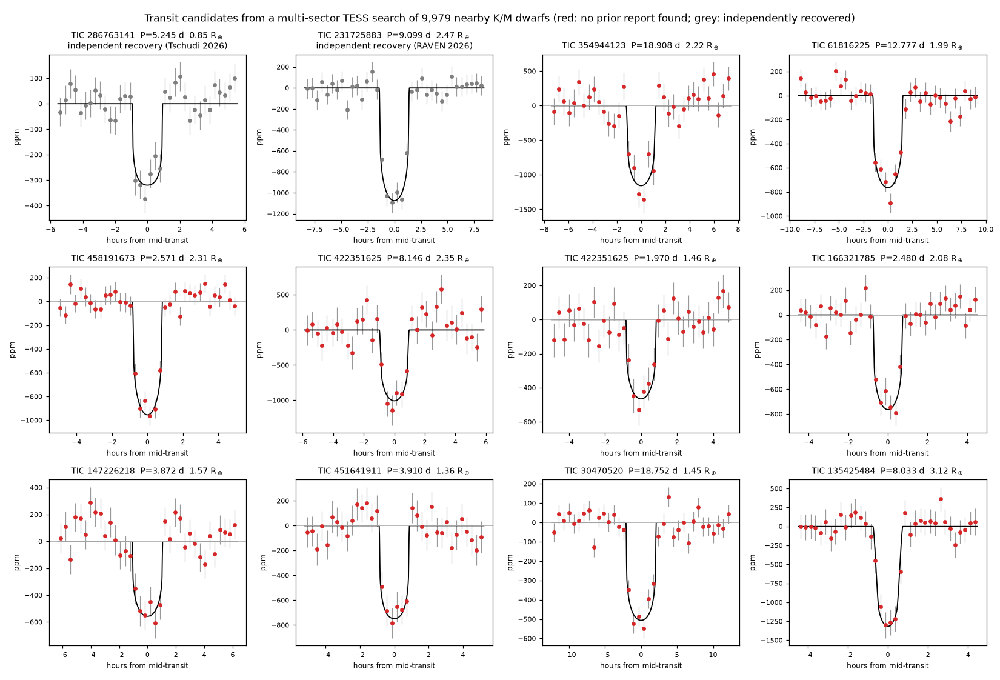
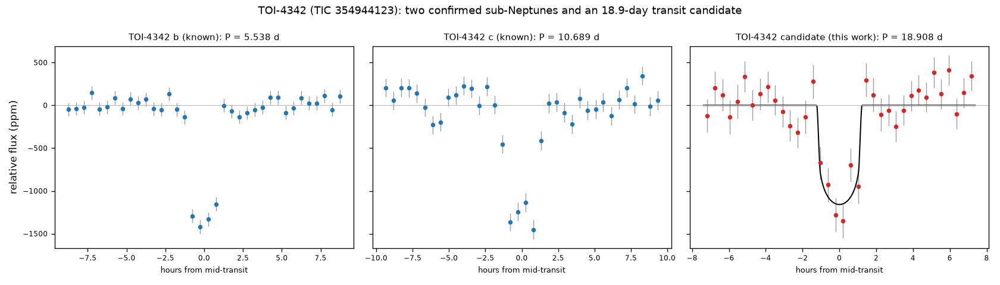
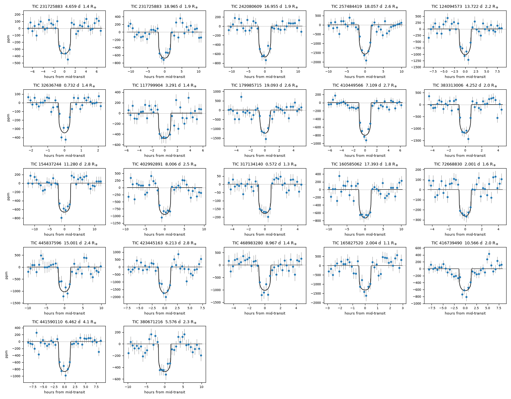
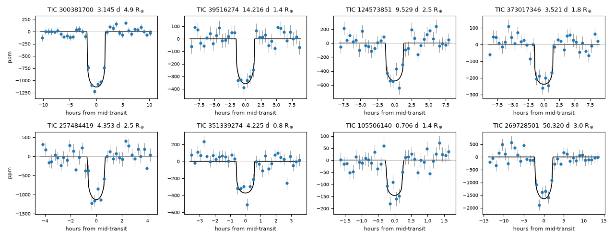
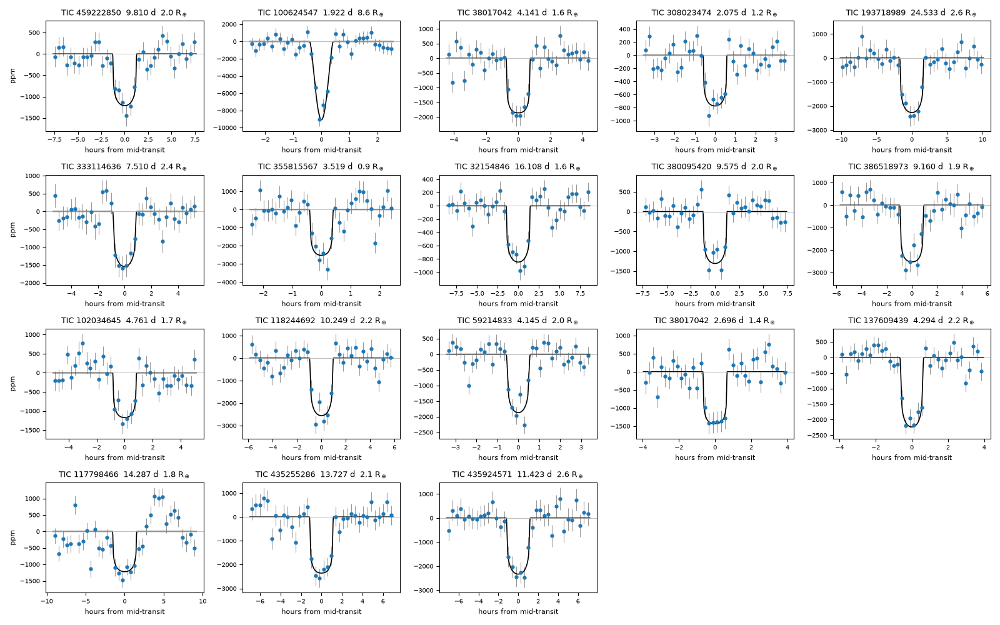
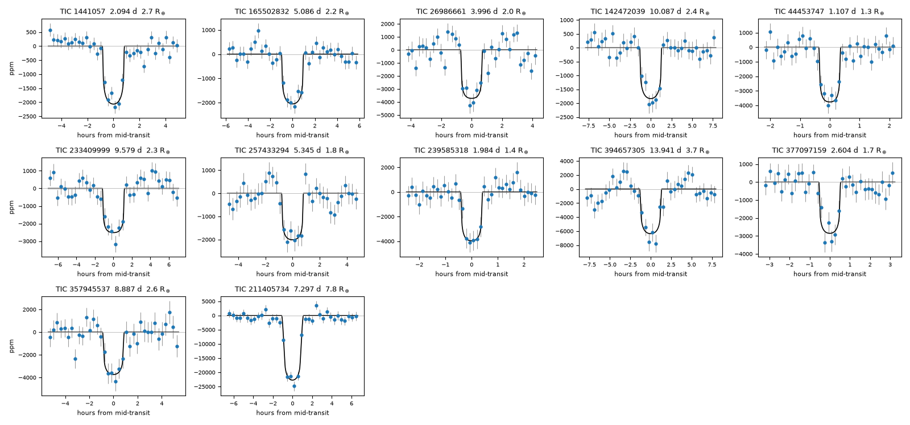
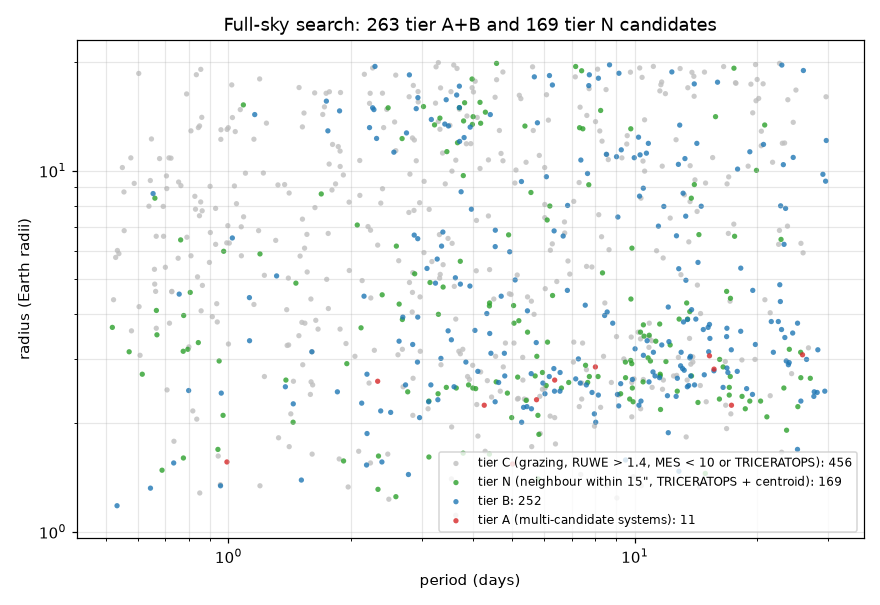

# Multi-sector TESS transit searches of nearby K and M dwarfs and of TOI hosts

Independent searches of NASA TESS light curves for small transiting planets. The first combines
the newest TESS sectors (97–105) with every earlier sector of 9,979 nearby K and M dwarfs. The
second, added on 8 October 2026, looks for additional planets around the hosts of 6,430 TESS
Objects of Interest (TOIs) after masking the known TOIs.

- **Full-sky search, second release (9 October 2026): 432 candidates** (tiers A, B and N below) from
  4.04 million FGKM dwarfs brighter than T = 13.5, combining all of their TESS sectors (1–104). Every
  one now passes TRICERATOPS (FPP < 0.5, NFPP < 0.1) and has MES ≥ 10. New in this release: 169 tier N
  candidates recovered from crowded fields with TRICERATOPS and a centroid test calibrated on 1,000
  known planets; false-alarm rates measured on the inverted light curves of 400,000 stars; TRICERATOPS
  for every tier A and B candidate; and a search of the SNR 7.5–9 band, which turned out to be mostly
  noise (92 signals listed as tier L, not counted). The stricter checks moved 137 first-release
  candidates to tier C. With the 60 earlier candidates below, the running total is **492 candidates**.
- **First release (7 October 2026):** 10 transit-candidate signals on 9 stars for which we found
  no prior report, including a possible third transiting planet in the TOI-4342 system, and two
  signals that others had reported earlier in 2026.
- **Update (8 October 2026):** 20 more candidates for which we found no prior report:
  6 from completing the fully coherent search of the K/M dwarfs and 14 from the TOI-host search,
  plus two further signals on TIC 231725883. Every TOI-host candidate is on a star that already
  has a TOI, which makes it less likely to be a false positive.
- **Update 2 (8 October 2026):** 6 more candidates for which we found no prior report, from
  re-checking SPOC detections that have not become TOIs and from a search for periods of 20–100
  days, plus independent recoveries of 2 signals that other independent researchers posted on
  Zenodo days earlier. They include possible second planets around the confirmed-planet hosts
  TOI-669 (matching a weak radial-velocity signal) and TOI-5997, a 50.3 d signal on TOI-4566, and a
  sub-Earth-sized signal on GJ 774, an M-dwarf pair 13 pc away.
- **Update 3 (8 October 2026):** 18 more from a search of 22,448 fainter M dwarfs
  (11.5 < T ≤ 12.5), including GJ 3514, an M4.5 dwarf 17.6 pc away, and a star with two signals.
  The same search found two of our earlier candidates again, and one signal that another
  independent project had posted on GitHub three days earlier.
- **Update 4 (8 October 2026):** 12 more from the faintest M dwarfs searched so far
  (12.5 < T ≤ 13.5, 84,863 stars), including LHS 1083 (36 pc) and a possible member of the young
  Octans association.

**These are planet candidates, not confirmed planets.** Each passes automated and pixel-level
vetting, but TESS alone cannot rule out every false-positive scenario. Ground-based photometry,
high-resolution imaging, or radial velocities are needed to confirm or reject them.



## Candidates

Radii use TIC 8.2 stellar radii. FPP is the TRICERATOPS false-positive probability from TESS
data alone (no follow-up imaging, no multiplicity boost), averaged over 10 runs from the update
onwards; the statistical-validation threshold is FPP < 0.015.

### First release (7 October 2026)

| TIC | Period (d) | Radius (R⊕) | Host (Teff, distance) | FPP | Status |
|---|---|---|---|---|---|
| 354944123 (TOI-4342) | 18.90820 | 2.21 ± 0.11 | 3880 K, 62 pc | 0.14 | no prior report found; third transiting signal in a system with two confirmed planets |
| 61816225 | 12.77703 | 1.99 ± 0.06 | 4380 K, 57 pc | 0.03 | no prior report found |
| 458191673 | 2.570687 | 2.31 ± 0.07 | 4470 K, 66 pc | 0.03 | no prior report found |
| 422351625 | 8.14641 | 2.35 ± 0.16 | 4410 K, 93 pc | – | no prior report found; second signal on the same star ↓ |
| 422351625 | 1.969879 | 1.46 ± 0.09 | 4410 K, 93 pc | – | no prior report found |
| 166321785 | 2.480128 | 2.08 ± 0.09 | 4380 K, 96 pc | – | no prior report found; two T≈15–16 stars at 9″ |
| 147226218 | 3.87159 | 1.57 ± 0.08 | 4840 K, 77 pc | – | no prior report found; T=16.6 star at 3.4″ |
| 451641911 | 3.90974 | 1.36 ± 0.05 | 3650 K, 41 pc | – | no prior report found; crowded field |
| 30470520 | 18.75190 | 1.45 ± 0.04 | 5150 K, 208 pc | – | no prior report found; crowded field, depth varies by sector |
| 135425484 | 8.03350 | 3.12 ± 0.15 | 4230 K, 79 pc | – | no prior report found; impact parameter 0.91 (near-grazing) |
| 286763141 (TOI-6284) | 5.244548 | 0.85 ± 0.04 | 3550 K, 21 pc | 0.03 | independent recovery; reported as "TOI-6284.02" by [Tschudi 2026](https://arxiv.org/abs/2607.23781) |
| 231725883 | 9.098778 | 2.47 ± 0.07 | 5110 K, 155 pc | – | independent recovery; in the RAVEN first-stage detection list ([Lafarga et al. 2026](https://arxiv.org/abs/2603.22597)), not in their vetted list; the update finds two more signals on this star |

Each candidate has a folder in [`candidates/`](candidates/) with the vetting plot and metrics,
the transit fit (P, T0, Rp/R*, b, ρ*), PRF centroid offsets, nearby stars bright enough to mimic
the signal, and the TRICERATOPS result where computed. All parameters are in
[`results_public/candidates.csv`](results_public/candidates.csv).

### TOI-4342: a third transiting candidate



TOI-4342 b and c are confirmed sub-Neptunes at 5.54 and 10.69 d
([Tey et al. 2023](https://arxiv.org/abs/2301.01370); masses from
[ESPRESSO, 2026](https://arxiv.org/abs/2601.22115), which also reports a probably non-transiting
47.5 d RV candidate). We find a third transit signal at 18.9082 d with the same radius as b and c
(2.2 R⊕), with transits in 8 sectors (11σ in Sectors 13–93, 7σ in 101–103). The difference-image centroid
is within 7–16″ of the star in each 2-min sector, and no star within 30″ is bright enough to
produce the dip. Its predicted RV semi-amplitude is about 2 m/s. The TOI-host search, which masks
b and c before searching, finds it again as the strongest remaining signal.

### Added 8 October 2026

These passed every check: no match in the ExoFOP TOI and CTOI lists, the NASA Exoplanet
Archive, the SPOC TCE tables or the literature check (below); all 17 LEO-Vetter tests; MES ≥ 7.1;
per-sector depths consistent (χ²/dof ≤ 5); a difference-image centroid within 15″ of the target;
no TIC star within 15″ bright enough to produce the dip; and no report found by a web search on
each TIC ID and host TOI ([`novelty_check.md`](results_public/novelty_check.md)). "Known on star" lists the TOIs
(with TFOPWG disposition) on the same star.



| TIC | Period (d) | Radius (R⊕) | Host (Teff, T mag, distance) | Known on star | FPP | Notes |
|---|---|---|---|---|---|---|
| 32636748 | 0.732324 | 1.43 | 4094 K, 10.4, 55 pc | – | unstable | K/M dwarfs; ultra-short period; TRICERATOPS gives 0.00–0.98 over 10 runs for this 0.7 h transit |
| 117799904 | 3.291093 | 1.39 | 4045 K, 10.9, 61 pc | TOI-2457.01 (PC, 14.20 d) | 0.053 | K/M dwarfs; second signal on TOI-2457 (found by both searches) |
| 124094573 | 13.721761 | 2.18 | 4590 K, 11.4, 110 pc | – | 0.068 | K/M dwarfs |
| 242080609 | 16.955247 | 1.89 | 4500 K, 9.7, 54 pc | – | 0.026 | K/M dwarfs; T=9.7, 5 transits |
| 257484419 | 18.056783 | 2.58 | 4184 K, 11.2, 81 pc | – | 0.016 | K/M dwarfs |
| 179985715 | 19.092785 | 2.56 | 4047 K, 11.3, 71 pc | TOI-249.01 (PC, 6.62 d) | 0.132 | K/M dwarfs; second signal on TOI-249; grazing (b=0.9); Gaia RUWE 2.0 |
| 317134140 | 0.571863 | 1.31 | 5563 K, 10.7, 174 pc | TOI-2514.01 (PC, 6.39 d) | 0.066 | TOI hosts; ultra-short period |
| 72668830 | 2.000544 | 1.59 | 4985 K, 10.4, 116 pc | TOI-4296.01 (FA, 19.97 d); TOI-4296.02 (PC, 5.10 d); TOI-4296.03 (PC, 12.49 d) | 0.105 | TOI hosts |
| 165827520 | 2.004481 | 1.15 | 3230 K, 12.3, 34 pc | TOI-3494.01 (PC, 7.75 d) | 0.088 | TOI hosts; a star 0.59″ away (Δ*I* = 2.9) is known from imaging (Matson et al. 2025), so the radius is a lower limit |
| 383313006 | 4.251808 | 2.05 | 3719 K, 11.8, 73 pc | TOI-6758.01 (PC, 12.61 d) | 0.165 | TOI hosts |
| 380671216 | 5.575799 | 2.29 | 5729 K, 10.6, 191 pc | TOI-5495.01 (PC, 9.66 d) | 0.047 | TOI hosts |
| 423445163 | 6.212551 | 2.75 | 4593 K, 12.5, 187 pc | TOI-6489.01 (PC, 2.92 d) | 0.016 | TOI hosts |
| 441590110 | 6.462490 | 4.13 | 6263 K, 11.6, 436 pc | TOI-5187.01 (PC, 17.86 d) | 0.020 | TOI hosts |
| 410449566 | 7.109099 | 2.70 | 5949 K, 11.5, 239 pc | TOI-7546.01 (PC, 9.64 d) | 0.224 | TOI hosts |
| 402992891 | 8.005848 | 2.48 | 5589 K, 11.0, 164 pc | TOI-7356.01 (PC, 17.40 d) | 0.027 | TOI hosts |
| 468983280 | 8.966677 | 1.41 | 3547 K, 11.7, 45 pc | TOI-5489.01 (PC, 3.15 d); TOI-5489.02 (PC, 4.92 d) | 0.121 | TOI hosts; TOI-5489 b and c are confirmed planets, so this would be a third |
| 416739490 | 10.565600 | 2.03 | 5554 K, 10.8, 150 pc | TOI-5697.01 (PC, 6.22 d) | 0.061 | TOI hosts |
| 154437244 | 11.279747 | 2.84 | 6173 K, 11.1, 273 pc | TOI-5989.01 (PC, 6.87 d) | 0.015 | TOI hosts |
| 445837596 | 15.000796 | 2.42 | 5127 K, 11.7, 182 pc | TOI-3896.01 (PC, 4.38 d) | 0.020 | TOI hosts; TOI-3896 b is a confirmed planet |
| 160585062 | 17.392551 | 1.78 | 4568 K, 12.2, 157 pc | TOI-7333.01 (PC, 6.26 d) | 0.040 | TOI hosts; TOI-7333 b is a confirmed planet |

**TIC 231725883: three signals.** The 9.0988 d signal from the first release (also in the RAVEN
first-stage list) is joined by signals at 4.6593 d (1.43 R⊕) and 18.9653 d (1.95 R⊕), each found
by the coherent search after masking the previous one, each passing all LEO-Vetter tests and
each with consistent depths across sectors. The period ratios are 1.95 and 2.08. A TIC star 13″
away could produce the 4.66 d and 18.97 d dips (but not the deeper 9.10 d one) if it were an
eclipsing binary, so these two are listed separately in
[`results_public/candidates_2026-10-08.csv`](results_public/candidates_2026-10-08.csv), together
with the other signals that pass everything except the 15″ neighbour check.

**TIC 143168991 (TOI-7580), 26.56 d: rejected.** The K/M dwarf search found it with 4 transits,
but two of them fall within 0.2 h of TOI-7580.01 transits; with the TOIs masked only two remain.

### Added 8 October 2026: unpromoted SPOC detections and longer periods

Two more searches found 8 signals that pass every check: 6 for which we found no prior report, and
2 that other independent researchers posted on Zenodo a few days earlier (TRICERATOPS not yet run):

- **SPOC detections that have not become TOIs.** SPOC reports every signal above its threshold as
  a threshold-crossing event (TCE); TOIs are selected from these, and many TCEs are never followed
  up. We re-measured the 14,112 TCEs on 8,698 FGKM dwarfs that are not TOIs or CTOIs, adding all
  later sectors, and vetted them like our own signals (`build_tce_targets.py`, `tce_refit.py`,
  `triage_tce.sh`). ExoMiner++ ([Valizadegan et al. 2025](https://arxiv.org/abs/2502.09790),
  [2026](https://arxiv.org/abs/2601.14877)), a neural network that classifies every SPOC TCE,
  lists 17 of the 79 signals that passed every LEO-Vetter test as planet candidates, so those count
  as reported. Most of the signals it scores as false positives also fail our centroid test. TCEs
  from SPOC's latest multi-sector search (Sectors 1–96) have not yet been through TOI vetting, so
  some of these may still become TOIs.
- **Periods of 20–100 days.** A stack-slide search of the 3,661 K/M dwarfs and 3,271 TOI hosts
  with at least six sectors, with the TOIs and the signals from the earlier searches masked.



| TIC | Period (d) | Radius (R⊕) | Host (Teff, T mag, distance) | Known on star | Notes |
|---|---|---|---|---|---|
| 105506140 | 0.706375 | 1.42 | 5216 K, 8.0, 44 pc | – | TCE re-check; HD 85706; weakest: centroid 13.8" in the best difference image but 17.1" on average, grazing (b = 0.95), and ExoMiner++ scores its SPOC TCEs 0.34 and 0.45 (below its 0.5 threshold) |
| 300381700 | 3.145257 | 4.87 | 5999 K, 12.4, 598 pc | TOI-7387.01 (PC, 9.09 d) | TCE re-check; second signal on TOI-7387; reported on 4 October by Tovar Contreras (Zenodo 23134068) |
| 373017346 | 3.521493 | 1.79 | 5844 K, 10.6, 211 pc | TOI-4450.01 (PC, 10.69 d) | TCE re-check; second signal on TOI-4450 |
| 351339274 | 4.225136 | 0.75 | 3529 K, 9.2, 13 pc | – | TCE re-check; GJ 774 A; its companion GJ 774 B, 17.6" away and 1.2 mag fainter, could be the host instead (0.75 R⊕ on A, about 0.9 R⊕ on B) |
| 257484419 | 4.353306 | 2.45 | 4184 K, 11.2, 81 pc | – | TCE re-check; second signal on the star of our 18.06 d update candidate; reported on 3 October by Ozturk (Zenodo 23118499) |
| 124573851 | 9.529248 | 2.48 | 5625 K, 10.2, 143 pc | TOI-669.01 (CP, 3.94 d) | TCE re-check; second signal on TOI-669; matches a weak radial-velocity signal at 9.61 ± 0.52 d (Akana Murphy et al. 2023); confirmed: TOI-669 b |
| 39516274 | 14.216035 | 1.36 | 4674 K, 9.3, 46 pc | TOI-5997.01 (CP, 5.66 d) | TCE re-check; HIP 85850; second signal on TOI-5997 |
| 269728501 | 50.319649 | 2.98 | 4443 K, 11.6, 119 pc | TOI-4566.01 (PC, 2.08 d) | 20-100 d; second signal on TOI-4566 (see below) |

**TIC 269728501 (TOI-4566), 50.32 d.** Six transits in 17 sectors. SPOC's Sectors 1–96 search
listed two of them as a 754.8 d TCE, 15 times this period.

**TIC 235005571, 1.33 d: rejected.** It passed every automated check, but
[an RNAAS note](https://ui.adsabs.harvard.edu/abs/2026RNAAS..10..220R) shows the star is an
Algol-type eclipsing binary.

| Stage | TCE re-check | 20–100 d, K/M dwarfs | 20–100 d, TOI hosts |
|---|---|---|---|
| Stars searched | 8,698 | 3,661 | 3,271 |
| Signals | 14,112 | 9,179 | 6,421 |
| Pass pre-filters | 4,393 | 333 | 167 |
| Match a known planet, TOI or CTOI | 14 | 15 | 8 |
| Reported elsewhere (literature check, including ExoMiner++) | 251 | 2 | 3 |
| Match a neighbour's known signal | 30 | 4 | 0 |
| Unmatched and passing every LEO-Vetter test | 62 | 2 | 3 |
| … centroid more than 15″ from the target | 35 | 1 | 2 |
| … a TIC star within 15″ could produce the dip | 15 | 1 | 0 |
| … no FFI difference image, and SPOC's centroid is more than 15″ off | 3 | 0 | 0 |
| … none of these, MES ≥ 7.1, per-sector χ²/dof ≤ 5 | 8 | 0 | 1 |

The TCE re-check's last row includes TIC 235005571 and the two signals reported on Zenodo.

### Added 8 October 2026: faint M dwarfs

A stack-slide search of 22,448 M dwarfs (Teff ≤ 3,900 K, R ≤ 0.6 R☉) with 11.5 < T ≤ 12.5, fainter
than the first K/M sample and mostly observed only in full-frame images (TESS-SPOC and QLP light
curves, Sectors 1–104), vetted and checked at the pixel level in the same way. It recovered 346
signals already known as TOIs, planets or TCEs. 18 signals pass every check and have no prior
report; TIC 165827520 (2.00 d) and TIC 383313006 (4.25 d), from our update 2 list, were found
again; and TIC 417732194 (G 249-11, 5.307 d) had been posted on 5 October by another independent
project ([tess-transit-hunter](https://comdex4.github.io/tess-transit-hunter/findings.html)).



| TIC | Period (d) | Radius (R⊕) | Host (Teff, T mag, distance) | Notes |
|---|---|---|---|---|
| 100624547 | 1.922279 | 8.58 | 3541 K, 12.3, 77 pc | grazing (b ≈ 1), so the radius is poorly constrained (5.7–13.5 R⊕); crowded field (TIC contamination 0.32) |
| 308023474 | 2.074868 | 1.24 | 3687 K, 12.1, 62 pc | G 203-64 |
| 38017042 | 2.695824 | 1.44 | 3496 K, 12.4, 54 pc | two signals on this star (2.70 d and 4.14 d) |
| 355815567 | 3.519453 | 0.89 | 3149 K, 12.3, 18 pc | GJ 3514, an M4.5 dwarf 17.6 pc away |
| 38017042 | 4.141260 | 1.64 | 3496 K, 12.4, 54 pc | two signals on this star (2.70 d and 4.14 d) |
| 59214833 | 4.145226 | 2.00 | 3587 K, 12.2, 58 pc | crowded field (TIC contamination 0.25) |
| 137609439 | 4.294043 | 2.25 | 3339 K, 12.4, 61 pc | LSPM J1004+8023 |
| 102034645 | 4.760759 | 1.67 | 3671 K, 11.6, 56 pc | the radio galaxy ESO 243-29, 25" away and not in the TIC, adds ~39% of the flux, so the radius is underestimated |
| 333114636 | 7.510269 | 2.43 | 3894 K, 11.9, 87 pc | LSPM J0044+1748 |
| 386518973 | 9.159667 | 1.94 | 3467 K, 12.5, 55 pc | – |
| 380095420 | 9.574513 | 1.97 | 3745 K, 11.9, 77 pc | chromospherically active |
| 459222850 | 9.810046 | 2.03 | 3752 K, 12.3, 99 pc | – |
| 118244692 | 10.249236 | 2.16 | 3509 K, 12.2, 56 pc | H-alpha emission |
| 435924571 | 11.422839 | 2.60 | 3759 K, 12.4, 94 pc | HG 7-176 |
| 435255286 | 13.726825 | 2.10 | 3477 K, 12.2, 57 pc | G 5-38 |
| 117798466 | 14.286705 | 1.80 | 3653 K, 11.9, 67 pc | possibly young (space motion matches the AB Doradus moving group) |
| 32154846 | 16.107661 | 1.62 | 3816 K, 12.4, 102 pc | in the southern continuous viewing zone |
| 193718989 | 24.532923 | 2.58 | 3745 K, 12.2, 86 pc | – |

| Stage | Faint M dwarfs, 11.5 < T ≤ 12.5 |
|---|---|
| Stars searched | 22,448 |
| Signals found | 38,545 |
| Pass pre-filters | 2,281 |
| Match a known planet, TOI, CTOI or TCE | 346 (96 pass every LEO-Vetter test) |
| Reported elsewhere (literature check) | 8 |
| Match a neighbour's known signal | 18 |
| Unmatched and passing every LEO-Vetter test | 47 |
| … centroid more than 15″ from the target | 14 |
| … a TIC star within 15″ could produce the dip | 9 |
| … no FFI difference image | 2 |
| … none of these, MES ≥ 7.1, per-sector χ²/dof ≤ 5 | 21 (18 new, 2 ours, 1 on GitHub) |

### Added 8 October 2026: fainter M dwarfs

The same search of 84,863 M dwarfs with 12.5 < T ≤ 13.5. It recovered 625 known TOIs, planets
or TCEs. 104 new signals pass every LEO-Vetter test; the pixel checks reject 91 of them (in these
crowded fields mostly for a centroid offset or a capable neighbour), leaving 13. TIC 9994636
(0.894 d) is rejected: it is a double-lined spectroscopic binary (Kounkel et al. 2021), so its
5%-deep dip is probably an eclipse.



| TIC | Period (d) | Radius (R⊕) | Host (Teff, T mag, distance) | Notes |
|---|---|---|---|---|
| 44453747 | 1.106646 | 1.29 | 3088 K, 13.4, 36 pc | LHS 1083, an M4.5 dwarf 36 pc away |
| 239585318 | 1.983922 | 1.37 | 3121 K, 13.4, 37 pc | an equally bright star is 32" away |
| 1441057 | 2.093531 | 2.74 | 3602 K, 12.5, 109 pc | possible member of the young Octans association (~30 Myr); spot rotation 3.05 d |
| 377097159 | 2.604427 | 1.74 | 3315 K, 12.9, 50 pc | slow rotator (57-60 d) |
| 26986661 | 3.996223 | 2.03 | 3395 K, 13.3, 67 pc | LP 371-15 |
| 165502832 | 5.085657 | 2.24 | 3616 K, 13.5, 132 pc | – |
| 257433294 | 5.345440 | 1.75 | 3276 K, 12.8, 57 pc | flaring M dwarf |
| 211405734 | 7.297477 | 7.75 | 3488 K, 13.5, 127 pc | listed without a period in a giant-planet (GEMS) team's observing plan, so it may be their unpublished candidate |
| 357945537 | 8.887083 | 2.60 | 3451 K, 12.9, 77 pc | LP 335-28 |
| 233409999 | 9.578851 | 2.30 | 3475 K, 13.1, 90 pc | – |
| 142472039 | 10.086808 | 2.39 | 3848 K, 12.7, 114 pc | – |
| 394657305 | 13.941080 | 3.69 | 3606 K, 13.4, 113 pc | a brighter star (T = 11.0) 18.5" away could be the source (TIC contamination ratio 1.23) |

| Stage | Faint M dwarfs, 12.5 < T ≤ 13.5 |
|---|---|
| Stars searched | 84,863 |
| Signals found | 139,231 |
| Pass pre-filters | 8,521 |
| Match a known planet, TOI, CTOI or TCE | 625 (83 pass every LEO-Vetter test) |
| Reported elsewhere (literature check) | 27 |
| Match a neighbour's known signal | 130 |
| Unmatched and passing every LEO-Vetter test | 104 |
| … centroid more than 15″ from the target | 73 |
| … a TIC star within 15″ could produce the dip | 18 |
| … none of these, MES ≥ 7.1, per-sector χ²/dof ≤ 5 | 13 (12 candidates; TIC 9994636 rejected) |

### Full-sky search (8 October 2026)

First release; the second release below re-tiers it with measured false-alarm rates.

We searched every FGKM dwarf in TIC 8.2 with T ≤ 13.5, Teff ≤ 6,500 K and R ≤ 1.5 R☉ that our
earlier searches had not covered: 4,166,638 stars, 4,086,108 of them with TESS-SPOC, QLP or SPOC
light curves (22.4 million light curves, Sectors 1–104), indexed from the STScI open-data bucket
(`build_allsky_targets.py`, `index_s3.py`) and searched with stack-slide on AWS Graviton instances
in eight parts (`run_shard.py`).



| Stage | All eight parts |
|---|---|
| Stars searched | 4,039,203 |
| Signals found | 7,459,491 |
| Pass pre-filters (SNR ≥ 9, ≥ 3 transits, duration and shape cuts) | 609,021 |
| Match a known planet, TOI, CTOI or TCE | 3,829 |
| Reported elsewhere (literature check, including ExoMiner++, RAVEN and T16) | 2,477 |
| Unmatched and passing every LEO-Vetter test | 13,986 |
| … and MES ≥ 7.1, per-sector χ²/dof ≤ 5 | 9,962 |
| … and no centroid offset or capable TIC neighbour within 15″ | 726 |
| … likely binaries: in a binary catalog at the target or a matching eclipsing binary nearby, or fitted radius > 20 R⊕ | 140 |
| … reported in a paper found by NASA ADS (NGTS-19b, a brown dwarf; one DTARPS candidate) | 2 |
| … tier C: grazing (b ≥ 0.9) or Gaia RUWE > 1.4 | 184 |
| … tier A: more than one signal on the star | 19 |
| … tier B | 381 |

The pixel checks reject 93% of the signals that pass LEO-Vetter, mostly for a centroid offset or a
neighbour that could produce the dip: in full-frame images most signals at these depths come from
blended eclipsing binaries. All candidates, with fits, centroids and binary checks, are in
[`results_public/candidates_allsky.csv`](results_public/candidates_allsky.csv); tiers A–C have a
folder in [`candidates/allsky/`](candidates/allsky/).

**Reliability tiers.** Following an outside review, every candidate is now checked against Gaia DR3
(RUWE, eclipsing binaries, non-single-star orbits), the TESS eclipsing-binary catalog (Prša et al.
2022), APOGEE binaries (Kounkel et al. 2021) and VSX (`binary_check.py`), which flags both binaries
that earlier passed every automated check (TIC 9994636 and TIC 235005571). Tier A (several signals
on the star) and tier B (single) are counted as candidates; tier C (grazing, or RUWE > 1.4) is listed
but not counted. Of the 66 earlier candidates, 24 are tier A, 36 tier B and 6 tier C
([`results_public/tiers_earlier_candidates.csv`](results_public/tiers_earlier_candidates.csv)).

**Reliability and completeness, measured on a 1% pilot** (40,797 random stars; superseded by
the 399,408-star measurement in the second release below). Inverted copies of
20,430 light curves, in which any dip is a false alarm, give 24 signals that pass LEO-Vetter and the
cuts (SNR ≥ 7.5), and none survives the pixel checks; the real light curves give 14 (12 at SNR ≥ 9, 2 at 7.5–9).
Of 300 transits injected at a nominal (white-noise) SNR of 10, 57% are recovered at the injected
period and 21% at SNR ≥ 9: red noise in full-frame light curves lowers the measured SNR. These are
candidates, not validated planets; we expect false-positive rates of tens of percent in tier B,
lower in tier A, and the remaining blind spot is companions closer than ~1–2″, which only
high-resolution imaging can rule out.

### Full-sky search, second release (9 October 2026)

**Is the centroid test discarding planets?** The pixel checks rejected 93% of the signals that pass
LEO-Vetter. We ran the same vetting and pixel checks on 1,000 TOIs on stars like ours (601 confirmed or
known planets and 399 planet candidates, T = 10–13.5, using the TOI ephemerides). The centroid test
wrongly rejects only 2–3% of them (5.6% at MES 7–20), and 95% of the confirmed and known planets lie within 9.3″ of the target. Of 203
full-sky signals that match a TOI on a neighbouring star, the test flags 98–100% of those whose source
is more than 15″ away, and the measured offsets track the separations (medians of 19″, 32″, 51″ and
73″ for sources at 15–21″, 21–42″, 42–63″ and beyond). The 7,918 signals rejected for an offset are
therefore mostly blends ([`validation/centroid_calibration_tois.csv`](validation/centroid_calibration_tois.csv),
[`validation/centroid_calibration_neighbour_tois.csv`](validation/centroid_calibration_neighbour_tois.csv)).

**Signals with a neighbour inside 15″ (tier N).** The other pixel check, a TIC star within 15″ bright
enough to produce the dip, also rejected 31% of the known planets, because crowded fields are common.
We ran TRICERATOPS (Giacalone et al. 2021) on the 1,318 signals rejected only by this check or with no
usable difference image (`fpp_batch.py`): FFI cutouts from the TESS cubes on S3 (`s3cut.py`), Gaia DR3
field stars from VizieR, ten runs per signal, and nearby-star scenarios for neighbours within 30″, since
the centroid excludes sources farther out. TRICERATOPS does not use the centroid, so its probabilities
are combined with a centroid likelihood ratio: how likely the measured offset is if the transit is on
the target (the offsets of the 1,000 TOIs at similar MES) or on a capable neighbour (the same scatter
around the neighbour's position). On the calibration samples this ratio favours the neighbour for 83–100%
of the neighbour-caused signals whose source is 5–21″ away (75% within 5″), and the target for 88–96%
of the TOI planets when tested against a neighbour 8–14″ away (76% at 5″). Tier N requires a combined FPP
below 0.5 and NFPP below 0.1, MES ≥ 10, and the same binary, grazing and literature checks as tiers
A and B: 169 candidates. 111 of them have NFPP < 0.01, and 13 have FPP < 0.015 and NFPP < 0.001, the
TRICERATOPS validation thresholds, though validation also needs high-resolution imaging. The
`FPP_c`, `NFPP_c` and `BF` columns of the catalog give the combined values and the centroid ratio.

**False alarms, measured.** We searched the inverted light curves of 399,408 random full-sky stars,
in which every dip the pipeline finds is noise or a systematic, with the full pipeline down to SNR
7.5 ([`validation/false_alarms_inverted_399408_stars.csv`](validation/false_alarms_inverted_399408_stars.csv)).
Signals passing LEO-Vetter and the cuts, by pixel-check outcome, with the inverted counts scaled to the
4,039,203 stars searched:

| | Clean | Neighbour within 15″ only | Centroid offset |
|---|---|---|---|
| SNR ≥ 9, real | 726 | 1,294 | 7,918 |
| SNR ≥ 9, expected false alarms | 91 (9 found) | 243 (24) | 2,134 (211) |
| SNR 7.5–9, real | 382 | 448 | 2,652 |
| SNR 7.5–9, expected false alarms | 273 (27) | 263 (26) | 2,265 (224) |

False alarms concentrate at low multiple-event statistic (MES): about half of the clean SNR ≥ 9 signals
with MES < 10 are expected to be false alarms, 16% of those with MES 10–12, and fewer than 6% above
(90% upper limit). We therefore moved the 78 first-release candidates with MES < 10 to tier C, and tier N
requires MES ≥ 10. TRICERATOPS cannot recognise noise: on the 24 inverted
false alarms with a close neighbour it passed 5, but only 1 of them has MES ≥ 10, so we expect about
10 false alarms among the 169 tier N candidates
([`validation/triceratops_inverted_close_neighbour.csv`](validation/triceratops_inverted_close_neighbour.csv)).
These rates apply to the full-sky search; the earlier samples keep their tiers, because their hosts
(TOI hosts and M dwarfs) have far more planets per star, so the same false-alarm rate per star is a
much smaller fraction of their candidates.

**The SNR 7.5–9 band.** Injections show why a lower threshold is tempting: of 700 transits injected at
a nominal SNR of 10 into random full-sky targets, 22% are recovered at SNR ≥ 9 and 48% at SNR ≥ 7.5
([`validation/injection_recovery_allsky_snr10_n700.csv`](validation/injection_recovery_allsky_snr10_n700.csv)).
We re-downloaded the light curves of the 267,000 stars with a signal at SNR 7.5–9 and vetted their
302,000 signals the same way (`collect.py --from-signals`): 382 pass every check, but about 270 of them
are expected to be false alarms. The 92 with MES ≥ 9 that also pass the binary and grazing checks are
listed as tier L (about 30% false alarms expected) and are not counted.

**TRICERATOPS for tiers A and B.** We ran TRICERATOPS on all 322 tier A and B candidates that
remained after the false-alarm cut, with the same settings and the centroid ratio over capable
neighbours within 30″. The median FPP is 0.05 (0.025 for tier A), and 41 candidates have FPP < 0.015
and NFPP < 0.001. The 59 that fail the tier N thresholds (FPP < 0.5, NFPP < 0.1) look like eclipsing
binaries (median radius 8.9 R⊕ against 3.6 R⊕ for the rest, median impact parameter 0.78) and move to
tier C, so every counted full-sky candidate meets the same bar. In all, 137 first-release candidates
moved to tier C (78 for MES < 10 and 59 for TRICERATOPS), and 4 tier A candidates became tier B
because the other signal on their star moved.

| Tier | Full-sky first release | Second release |
|---|---|---|
| A (several candidates on the star) | 19 | 11 |
| B (single) | 381 | 252 |
| N (neighbour within 15″; TRICERATOPS and centroid) | – | 169 |
| C (grazing, RUWE > 1.4, MES < 10, or TRICERATOPS FPP ≥ 0.5 or NFPP ≥ 0.1; not counted) | 184 | 456 |
| L (SNR 7.5–9, MES ≥ 9; not counted) | – | 92 |
| likely binary, likely nearby false positive, likely false alarm, reported elsewhere | 142 | 1,446 |

All 2,426 signals, with fits, centroids, binary checks and TRICERATOPS results where computed, are in
[`results_public/candidates_allsky.csv`](results_public/candidates_allsky.csv) (column `set`: SNR ≥ 9,
SNR 7.5–9, or neighbour within 15″); tiers A, B, C, N and L have folders in
[`candidates/allsky/`](candidates/allsky/).

### Predicted transit times

[`candidates/predictions.csv`](candidates/predictions.csv) lists every predicted transit of the
first-release candidates through June 2027 with 1σ uncertainties (5–15 min). TESS observes TIC
61816225, 458191673 and 451641911 again in Sectors 111–114, and TIC 422351625 and 135425484 in
Sector 114. This file was committed before those data exist.

## Method

The approach follows Pavel Rabtsevich's search that found TIC 4206066
([write-up](https://doi.org/10.5281/zenodo.22967456), [data](https://doi.org/10.5281/zenodo.22999133)):
detect a signal in recent TESS data and confirm it in archival sectors. SPOC's latest
multi-sector search covers Sectors 1–96, and stars observed only in full-frame images never get a
SPOC multi-sector search at all. A shallow transit that is 5–8σ per sector can stay below every
single-sector threshold while reaching 10–20σ when all sectors are combined.

1. **Targets** (`fetch_targets.py`, `build_targets.py`): TIC 8.2 dwarfs with T ≤ 11.5,
   0.1 < R* ≤ 0.75 R☉, Teff ≤ 5300 K, observed by QLP in Sectors 97–105: 9,979 stars.
   TOI hosts (`build_toi_hosts.py`): every host of a TOI dispositioned CP, KP, PC or APC: 6,430
   stars.
2. **Light curves** (`index_products.py`, `download.py`): one product per star and sector,
   preferring SPOC 2-min PDCSAP, then TESS-SPOC FFI PDCSAP, then QLP. 73,226 light curves for the
   K/M dwarfs and 54,189 for the TOI hosts. Each worker process fetches one star's sectors
   concurrently and stores them as one compressed array file.
3. **Search** (`search.py`, `fastbls.py`): per-sector biweight detrending (wotan, fitted to
   10-minute means and interpolated; see Performance), Lomb–Scargle
   prewhitening of fast rotators (P_rot < 3 d), and box least squares over 0.5–30 d on a
   period grid set by each star's density. Three variants:
   - *coherent*: astropy BLS on the full-baseline grid (~17 s per star);
   - *semi-coherent*: per-season BLS statistics summed, then the top peaks refined coherently
     (~4 s per star), which misses ~15% of weak signals (see Validation);
   - *stack-slide* (`--method stack`, added in the update): each season is folded once per
     coarse frequency; for each fine frequency the folded seasons are shifted by the phase they
     accumulate and summed, which is phase-coherent across seasons (~9 s per star).

   The K/M dwarfs were searched with the coherent and semi-coherent variants, the TOI hosts with
   stack-slide. Up to 3 signals per star (4 for TOI hosts) by iterative masking.
4. **Masking known planets** (`search.py --mask-tois`): for the TOI hosts, every TOI is masked
   before the search, using its catalogue ephemeris widened by 3σ of its propagated timing error
   and our own refit where the signal is detected. Vetting removes the same transits.
5. **Known-signal matching** (`known.py`, `fetch_known.py`): ExoFOP TOIs and CTOIs, NASA Exoplanet
   Archive planets, all public SPOC TCE tables, including period harmonics and TIC neighbours
   within 2.5′.
6. **Literature check** (`literature.py`, added in the update): the RAVEN and T16 candidate tables;
   the SPOC TCEs that ExoMiner++ classifies as planet candidates
   ([Valizadegan et al. 2025](https://arxiv.org/abs/2502.09790),
   [2026](https://arxiv.org/abs/2601.14877)); the LEO-Vetter M-dwarf candidates (Kunimoto et al.
   2025, VizieR J/AJ/170/280); the Eschen et al. (2024) M-dwarf candidates; and TIC IDs, TOI
   designations and nearby periods in the tables and text of 2,037
   arXiv astro-ph.EP papers whose abstracts mention TESS, TOIs or TICs (read from arXiv's HTML
   versions, plus the e-print for papers whose candidate tables are machine-readable only). A
   matching signal is tagged `reported`. Run on the first release, it flags exactly
   the two signals that our manual check had found already published.
7. **Vetting** (`vet.py`): transit-masked re-detrending, the 13 false-alarm and 4 false-positive
   tests of [LEO-Vetter](https://github.com/mkunimoto/LEO-vetter) (Kunimoto et al. 2025),
   per-sector depth consistency, and old-vs-new sector detection. LEO-Vetter's per-cadence loop
   is replaced by a compiled equivalent (same results, 2–5× faster vetting). The diagnostic plot
   is drawn only for signals with at most one LEO-Vetter failure (`--plot-max-fails`).
8. **Pixel and field checks** (`followup.py`, automated in the update): TIC stars within 2.5′
   that could produce the depth as eclipsing binaries (`neighbors.py`), and FFI difference-image
   PRF centroids with [transit-diffImage](https://github.com/stevepur/transit-diffImage) in the
   two sectors with the strongest transits and smallest cutouts, with LEO-Vetter's 15″ limit.
   For the first release these were run by hand (`pixel_vet.py`, `tpf_pixels.py`).
9. **Characterisation**: batman + emcee transit fits with a TIC stellar-density prior
   (`fit_transit.py`) and [TRICERATOPS](https://github.com/stevengiacalone/triceratops) FPP
   (`export_fold.py`, `fpp.py`, now vectorised, with the Gaia query cached and 10 runs averaged).
10. **Novelty**: for the first release, ExoFOP pages, TOI/CTOI lists, NASA Exoplanet Archive, SPOC
    TCEs, the T16 catalogue ([Roth et al. 2026](https://arxiv.org/abs/2604.18579)), the RAVEN
    tables, the [Tschudi 2026](https://arxiv.org/abs/2607.23781) survey source, and web searches on
    every TIC ID, run on 2026-10-07 (see
    [`results_public/novelty_check.md`](results_public/novelty_check.md)); for the update, steps 5
    and 6 plus web searches on every candidate TIC ID and host TOI.

### Funnel

| Stage | K/M dwarfs | TOI hosts |
|---|---|---|
| Stars searched | 9,972 | 6,430 |
| Signals found | 41,758 | 15,222 |
| Pass pre-filters (SNR ≥ 9, ≥ 3 transits, duration and shape cuts; TOI hosts: FGKM dwarfs only) | 1,549 | 660 |
| Match a known planet, TOI, CTOI or TCE | 236 (of which 109 pass every LEO-Vetter test) | 229 (of which 94 pass every LEO-Vetter test) |
| Match a published list outside ExoFOP (literature check) | 14 | 10 |
| Match a neighbour's known signal | 23 | 1 |
| Unmatched | 1,276 | 420 |
| Unmatched and passing every LEO-Vetter test | 38 | 40 |
| … centroid more than 15″ from the target | 11 | 11 |
| … a TIC star within 15″ could produce the dip | 14 | 11 |
| … neither | 13 | 18 |
| … and MES ≥ 7.1, per-sector χ²/dof ≤ 5 | 13 | 16 |

The last row includes six first-release candidates (K/M dwarfs) and TOI-4342's 18.9 d signal (TOI
hosts); TIC 117799904 is counted in both columns; TIC 143168991's 26.56 d signal (above) was
rejected by hand.

## Validation

- **Blind recovery of TIC 4206066.** Both of Rabtsevich's signals were found without prior
  knowledge: 3.18278 d (his 3.182785 d) and 11.13274 d (his 11.13274 d), with Rp = 1.41 R⊕ (his
  1.4) and the nearest depth-capable neighbour at 44.6″ (his ≳ 43″). See
  [`figures/validation_tic4206066.png`](figures/validation_tic4206066.png).
- **Known planets.** TOI-700 b and c, and L 98-59 b, c and d are recovered
  ([`validation/`](validation/)). With the TOIs masked, the TOI-host search recovers TOI-4342's
  18.9 d signal and the community candidate L 98-59 .04 (CTOI, 1.05 d).
- **Injection–recovery.** Transits injected at a nominal SNR of 10 into 300 random targets
  ([`validation/injection_recovery_snr10_n300.csv`](validation/injection_recovery_snr10_n300.csv)):

  | Search | Recovered at the injected period | Detected with SNR ≥ 9 | Median time per star |
  |---|---|---|---|
  | coherent | 60% | 92 (31%) | 17.5 s |
  | stack-slide | 62% | 88 (29%) | 8.9 s |
  | semi-coherent | 52% | 78 (26%) | 4.2 s |

  Of the SNR ≥ 9 detections, 6 were found only by the coherent search and 2 only by stack-slide;
  18 were found only by the coherent search and 4 only by the semi-coherent one.
- **False alarms.** Searching the inverted light curves of 1,500 random K/M dwarfs (`EXO_INVERT=1`),
  where any dip is a false alarm: 157 signals pass the pre-filters, 1 passes all LEO-Vetter tests,
  and none also has consistent per-sector depths. The real light curves of the same stars give
  6 new signals passing all LEO-Vetter tests, 4 of them with consistent depths. Inversion measures
  false alarms from noise and systematics, not astrophysical false positives such as background
  eclipsing binaries, which steps 8 and 9 address.
- **Automated vs manual checks.** On the first-release signals, `followup.py` passes 7 of the 12
  cleanly, flags the close neighbours we had noted by hand for 4 (TIC 166321785, 147226218,
  451641911, 30470520), and puts TOI-6284's 5.24 d centroid at 15.2″, just over the limit (our
  2-min pixel analysis gave 2.8″). It rejects TIC 264151965, which we had set aside, with a 106″
  offset.
- **Compiled LEO-Vetter loop.** On 6 test signals the compiled version gives the same pass/fail
  results and metrics equal to ~10⁻⁹ (`EXO_SLOW_LEO=1` runs the original).

### Performance

Measured on 200 random K/M dwarfs (median 5 sectors), with the stack-slide search:

| Change | Speed-up | Effect on results |
|---|---|---|
| Download in worker processes instead of threads (parsing was serialized by Python's GIL) | 3× on 16 vCPUs, more on larger machines | identical files |
| Stack-slide kernel: no division per trial box, branch-free shift-and-add, `floor` instead of `%` | 1.42× | same first signal and SNR on all 200 stars |
| Biweight trend fitted to 10-minute means (`EXO_TREND_BIN=0` restores full cadence) | 1.16× (14× for the trend itself) | residuals differ by ~30 ppm on quiet stars, within the trend's own noise; 100 injections at SNR 10: 30 detections against 28 |
| AWS Graviton4 (c8g) instead of Intel (c6i), same number of vCPUs | 2.6× | same first signal and SNR on all 200 stars; identical vetting results |

Together a star costs about 5× less to search than before (200 stars in 70 s on a 16-core
c8g.4xlarge). On Graviton, `batman-package` is built from source (`requirements.txt`). Splitting
long continuous stretches into shorter blocks for stack-slide (`EXO_SEASON_MAX`) gained only 10%
on this sample and changed some weak peaks, so it is off by default. Before these changes the
stack-slide kernel took 81% of the search time and detrending 14%.

## Reproducing

```bash
uv venv --python 3.12 .venv && uv pip install --python .venv/bin/python -r requirements.txt
# transit-diffImage is installed from GitHub (see requirements.txt). Its PRF download URL uses
# http://archive.stsci.edu, which now returns 404; change it to https in tessprfmodel.py.
uv venv --python 3.11 .venv-trice && uv pip install --python .venv-trice/bin/python -r requirements-triceratops.txt

cd pipeline
../.venv/bin/python fetch_targets.py        # TIC criteria query (~10 min)
../.venv/bin/python build_targets.py        # QLP S97-105 lists + Gaia GCNS columns
../.venv/bin/python fetch_known.py          # TOI/CTOI/planets/TCE catalogs
../.venv/bin/python literature.py           # RAVEN, T16, arXiv mentions; ~2 h the first time (arXiv allows
                                            # one request per 3 s), then only new papers are fetched
../.venv/bin/python index_products.py       # MAST product list
../.venv/bin/python download.py             # ~130 GB transferred, ~12 GB stored
../.venv/bin/python search.py targets.txt --method semi --out ../results/search_semi
../.venv/bin/python search.py targets.txt --method coherent --out ../results/search
./triage.sh                                 # collect -> vet -> shortlist
../.venv/bin/python followup.py             # neighbours + difference-image centroids

# TOI hosts
../.venv/bin/python build_toi_hosts.py
../.venv/bin/python index_products.py --targets ../data/catalogs/toi_hosts.parquet --out ../data/catalogs/manifest_toi.parquet
../.venv/bin/python download.py ../data/catalogs/toi_hosts.txt --manifest ../data/catalogs/manifest_toi.parquet
../.venv/bin/python search.py ../data/catalogs/toi_hosts.txt --stars ../data/catalogs/toi_hosts.parquet \
    --out ../results/search_toi --method stack --mask-tois --max-signals 4
../.venv/bin/python collect.py --search ../results/search_toi --stars ../data/catalogs/toi_hosts.parquet \
    --out ../results/cands_toi.csv --signals ../results/signals_toi.parquet --dwarfs
../.venv/bin/python vet.py ../results/cands_toi.csv --out ../results/vet_toi --stars ../data/catalogs/toi_hosts.parquet
../.venv/bin/python shortlist.py --cands ../results/cands_toi.csv --vet ../results/vet_toi --out ../results/vetted_toi.csv
../.venv/bin/python followup.py --vetted ../results/vetted_toi.csv --vet-dir ../results/vet_toi \
    --stars ../data/catalogs/toi_hosts.parquet --out ../results/followup_toi

# validation
../.venv/bin/python inject_test.py 300 --methods coherent,semi,stack
EXO_INVERT=1 ../.venv/bin/python search.py sample.txt --method stack --out ../results/search_inv

# update 2: unpromoted SPOC TCEs, and periods of 20-100 d
../.venv/bin/python build_tce_targets.py    # SPOC TCEs on dwarfs that never became TOIs or CTOIs
./triage_tce.sh                             # re-measure them with later sectors, vet, follow up
../.venv/bin/python search.py stars.txt --method stack --pmin 20 --pmax 100 \
    --premask ../results/search --out ../results/search_long      # 20-100 d, earlier signals masked
# updates 3 and 4: faint M dwarfs
../.venv/bin/python fetch_targets.py --tmin 11.5 --tmax 13.5 --rmax 0.6 --step 0.02 \
    --out ../data/catalogs/tic_faint_mdwarfs.parquet && ../.venv/bin/python build_faint_targets.py
../.venv/bin/python ads_check.py candidates.csv ads.csv                 # NASA ADS + Zenodo; ADS token
EXO_DATA_SOURCE=s3 ../.venv/bin/python download.py ...                  # read from the AWS mirror
# full-sky second release (inside AWS): TRICERATOPS for signals with a neighbour inside 15", fits,
# the SNR 7.5-9 band from the signals tables, and inverted light curves for false alarms
EXO_DATA_SOURCE=s3 ../.venv/bin/python fpp_batch.py list.csv --stars stars.parquet --out ../results/fpp_recover
../.venv/bin/python fit_batch.py list.csv --stars stars.parquet
../.venv/bin/python collect.py --from-signals ../results/signals_allsky.parquet --snr 7.5 --max-snr 9 \
    --stars shard.parquet --out ../results/cands_low.csv
EXO_INVERT=1 ../.venv/bin/python run_shard.py sample.parquet manifest.parquet --shard 0 --nshards 1 \
    --out ../results/search_inv_allsky --keep-snr 7.5
```

`EXO_DATA_SOURCE=s3` reads light curves from the STScI open-data bucket and falls back to MAST.
Inside AWS us-east-1 this is about 20 times faster than downloading from MAST.

`targets.txt` is one TIC ID per line. Per-candidate follow-up: `fit_transit.py`, `export_fold.py`,
`fpp.py` (in `.venv-trice`), `candidate_table.py`, `predict.py`, `make_figures.py`,
`package_candidates.py`. Light curves and catalogs are downloaded into `data/` and are not part
of the repository.

## Layout

```
pipeline/          code
candidates/        one folder per candidate + predictions.csv
figures/           figures used here
results_public/    all signals, vetted signals, candidate tables, novelty check
validation/        control-star vetting outputs and the injection-recovery tables
```

## Credits

This work uses data from the TESS mission, obtained from MAST at STScI: SPOC light curves
(Jenkins et al. 2016), TESS-SPOC FFI light curves (Caldwell et al. 2020), and QLP light curves
(Huang et al. 2020). It uses data from the ESA mission Gaia, processed by the Gaia DPAC, and the
Gaia Catalogue of Nearby Stars (Gaia Collaboration, Smart et al. 2021). This research has made use
of the Exoplanet Follow-up Observation Program (ExoFOP; DOI: 10.26134/ExoFOP5) website, which is
operated by the California Institute of Technology, under contract with the National Aeronautics
and Space Administration under the Exoplanet Exploration Program, and of the NASA Exoplanet
Archive, and of the VizieR catalogue access tool and the CDS XMatch service (CDS, Strasbourg). The
literature check uses the RAVEN (Lafarga et al. 2026) and T16 (Roth et al. 2026)
catalogues and arXiv. Software: astropy, numpy, scipy, numba, lightkurve, wotan, batman, emcee,
LEO-Vetter, transit-diffImage, tess-point, astrocut and TRICERATOPS.

Method inspired by Pavel Rabtsevich's TIC 4206066 study. Built with Claude Code (Anthropic).

## License

Code: MIT (see `LICENSE`). Results, tables and figures: CC BY 4.0.
